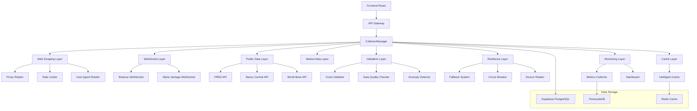
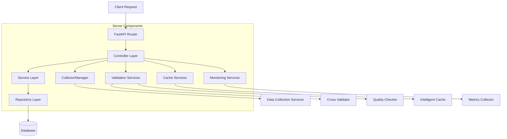
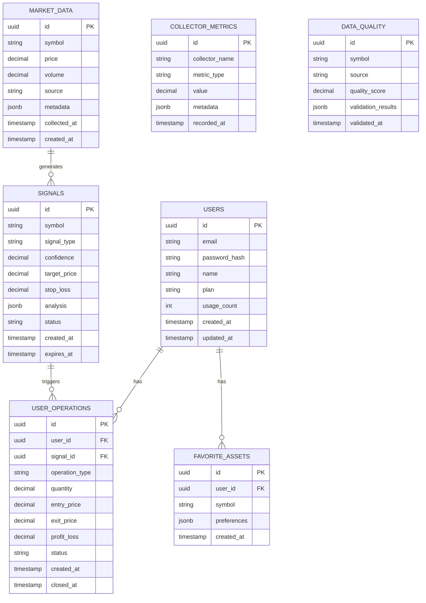

# Arquitetura Técnica - Fase 2
## Motor de Sinais ML - Sistema Avançado de Coleta de Dados

## 1. Arquitetura Geral



## 2. Descrição Tecnológica

- **Frontend**: React@18 + TypeScript + Tailwind CSS + Vite
- **Backend**: Python 3.11 + FastAPI + AsyncIO
- **Database**: Supabase (PostgreSQL) + TimescaleDB
- **Cache**: Redis (via Intelligent Cache)
- **Monitoring**: Custom Dashboard + Metrics Collection
- **WebSockets**: Native Python WebSockets + Binance API
- **HTTP Client**: aiohttp + requests

## 3. Definições de Rotas

| Rota | Propósito |
|------|----------|
| / | Página inicial da aplicação React |
| /login | Página de autenticação de usuários |
| /register | Página de cadastro de novos usuários |
| /dashboard | Dashboard principal com sinais e análises |
| /profile | Perfil do usuário e configurações |
| /admin/debug | Painel administrativo e debug |

## 4. Definições de API

### 4.1 Core API

**Coleta de Dados**
```
POST /api/collectors/collect
```

Request:
| Param Name | Param Type | isRequired | Description |
|------------|------------|------------|--------------|
| symbols | array[string] | true | Lista de símbolos para coletar |
| collectors | array[string] | false | Coletores específicos a usar |
| validate | boolean | false | Executar validação cruzada |

Response:
| Param Name | Param Type | Description |
|------------|------------|-------------|
| success | boolean | Status da operação |
| data | object | Dados coletados |
| metrics | object | Métricas da coleta |
| validation | object | Resultados da validação |

Example:
```json
{
  "symbols": ["AAPL", "GOOGL"],
  "collectors": ["yahoo_finance", "web_scraping"],
  "validate": true
}
```

**Status dos Coletores**
```
GET /api/collectors/status
```

Response:
| Param Name | Param Type | Description |
|------------|------------|-------------|
| collectors | array[object] | Status de cada coletor |
| system_health | object | Saúde geral do sistema |
| active_connections | number | Conexões ativas |

**Métricas do Sistema**
```
GET /api/metrics
```

Response:
| Param Name | Param Type | Description |
|------------|------------|-------------|
| performance | object | Métricas de performance |
| errors | array[object] | Erros recentes |
| cache_stats | object | Estatísticas do cache |

### 4.2 WebSocket API

**Dados em Tempo Real**
```
WS /ws/realtime
```

Message Types:
- `subscribe`: Inscrever-se em símbolos
- `unsubscribe`: Cancelar inscrição
- `data`: Dados em tempo real
- `error`: Mensagens de erro
- `status`: Status da conexão

## 5. Arquitetura do Servidor



## 6. Modelo de Dados

### 6.1 Definição do Modelo de Dados



### 6.2 Linguagem de Definição de Dados (DDL)

**Tabela de Métricas de Coletores**
```sql
-- Criar tabela de métricas
CREATE TABLE collector_metrics (
    id UUID PRIMARY KEY DEFAULT gen_random_uuid(),
    collector_name VARCHAR(100) NOT NULL,
    metric_type VARCHAR(50) NOT NULL,
    value DECIMAL(15,6) NOT NULL,
    metadata JSONB DEFAULT '{}',
    recorded_at TIMESTAMP WITH TIME ZONE DEFAULT NOW()
);

-- Criar índices
CREATE INDEX idx_collector_metrics_name ON collector_metrics(collector_name);
CREATE INDEX idx_collector_metrics_type ON collector_metrics(metric_type);
CREATE INDEX idx_collector_metrics_recorded_at ON collector_metrics(recorded_at DESC);

-- Converter para TimescaleDB hypertable
SELECT create_hypertable('collector_metrics', 'recorded_at');
```

**Tabela de Qualidade de Dados**
```sql
-- Criar tabela de qualidade
CREATE TABLE data_quality (
    id UUID PRIMARY KEY DEFAULT gen_random_uuid(),
    symbol VARCHAR(20) NOT NULL,
    source VARCHAR(50) NOT NULL,
    quality_score DECIMAL(5,4) NOT NULL CHECK (quality_score >= 0 AND quality_score <= 1),
    validation_results JSONB DEFAULT '{}',
    validated_at TIMESTAMP WITH TIME ZONE DEFAULT NOW()
);

-- Criar índices
CREATE INDEX idx_data_quality_symbol ON data_quality(symbol);
CREATE INDEX idx_data_quality_source ON data_quality(source);
CREATE INDEX idx_data_quality_score ON data_quality(quality_score DESC);
CREATE INDEX idx_data_quality_validated_at ON data_quality(validated_at DESC);

-- Dados iniciais
INSERT INTO data_quality (symbol, source, quality_score, validation_results)
VALUES 
    ('AAPL', 'yahoo_finance', 0.95, '{"completeness": 0.98, "accuracy": 0.92}'),
    ('GOOGL', 'web_scraping', 0.87, '{"completeness": 0.85, "accuracy": 0.89}'),
    ('BTCUSDT', 'binance_ws', 0.99, '{"completeness": 1.0, "accuracy": 0.98}');
```

**Tabela de Cache Inteligente**
```sql
-- Criar tabela de cache
CREATE TABLE intelligent_cache (
    key VARCHAR(255) PRIMARY KEY,
    value JSONB NOT NULL,
    ttl INTEGER NOT NULL,
    access_count INTEGER DEFAULT 0,
    last_accessed TIMESTAMP WITH TIME ZONE DEFAULT NOW(),
    created_at TIMESTAMP WITH TIME ZONE DEFAULT NOW(),
    expires_at TIMESTAMP WITH TIME ZONE NOT NULL
);

-- Criar índices
CREATE INDEX idx_cache_expires_at ON intelligent_cache(expires_at);
CREATE INDEX idx_cache_access_count ON intelligent_cache(access_count DESC);
CREATE INDEX idx_cache_last_accessed ON intelligent_cache(last_accessed DESC);

-- Função para limpeza automática
CREATE OR REPLACE FUNCTION cleanup_expired_cache()
RETURNS INTEGER AS $$
DECLARE
    deleted_count INTEGER;
BEGIN
    DELETE FROM intelligent_cache WHERE expires_at < NOW();
    GET DIAGNOSTICS deleted_count = ROW_COUNT;
    RETURN deleted_count;
END;
$$ LANGUAGE plpgsql;
```

**Configurações de Permissões Supabase**
```sql
-- Permissões básicas para anon
GRANT SELECT ON collector_metrics TO anon;
GRANT SELECT ON data_quality TO anon;

-- Permissões completas para authenticated
GRANT ALL PRIVILEGES ON collector_metrics TO authenticated;
GRANT ALL PRIVILEGES ON data_quality TO authenticated;
GRANT ALL PRIVILEGES ON intelligent_cache TO authenticated;

-- RLS (Row Level Security) policies
ALTER TABLE collector_metrics ENABLE ROW LEVEL SECURITY;
ALTER TABLE data_quality ENABLE ROW LEVEL SECURITY;

-- Política para métricas (todos podem ler)
CREATE POLICY "Allow read access to collector_metrics" ON collector_metrics
    FOR SELECT USING (true);

-- Política para qualidade (todos podem ler)
CREATE POLICY "Allow read access to data_quality" ON data_quality
    FOR SELECT USING (true);
```

## 7. Considerações de Arquitetura

### 7.1 Escalabilidade

- **Horizontal**: Sistema preparado para múltiplas instâncias
- **Vertical**: Otimização de recursos por componente
- **Cache Distribuído**: Redis para cache compartilhado
- **Load Balancing**: Source Rotator para distribuição de carga

### 7.2 Resiliência

- **Circuit Breaker**: Proteção contra falhas em cascata
- **Fallback System**: Recuperação automática entre fontes
- **Rate Limiting**: Proteção contra sobrecarga
- **Retry Logic**: Tentativas automáticas com backoff

### 7.3 Monitoramento

- **Métricas em Tempo Real**: Dashboard web ativo
- **Logging Estruturado**: Logs JSON para análise
- **Health Checks**: Verificação contínua de saúde
- **Alertas**: Notificações automáticas de problemas

### 7.4 Segurança

- **Autenticação**: Supabase Auth integrado
- **Autorização**: RLS no banco de dados
- **Rate Limiting**: Proteção contra ataques
- **Validação**: Sanitização de entrada
- **Secrets**: Variáveis de ambiente seguras

### 7.5 Performance

- **Async/Await**: Operações não-bloqueantes
- **Connection Pooling**: Reutilização de conexões
- **Cache Inteligente**: TTL adaptativo
- **Batch Processing**: Processamento em lote
- **Indexação**: Índices otimizados no banco

## 8. Padrões de Design Implementados

### 8.1 Padrões Estruturais

- **Adapter**: Adaptação de diferentes APIs
- **Facade**: CollectorManager como interface unificada
- **Proxy**: Proxy Rotator para web scraping
- **Decorator**: Rate Limiter como decorador

### 8.2 Padrões Comportamentais

- **Strategy**: Diferentes estratégias de fallback
- **Observer**: Monitoramento de métricas
- **State**: Estados dos coletores
- **Chain of Responsibility**: Pipeline de validação

### 8.3 Padrões de Criação

- **Factory**: Criação de coletores
- **Builder**: Configuração de componentes
- **Singleton**: Cache e métricas globais

## 9. Deployment e DevOps

### 9.1 Estrutura de Deployment

```
├── docker-compose.yml
├── Dockerfile
├── requirements.txt
├── .env.example
└── scripts/
    ├── setup.sh
    ├── deploy.sh
    └── health_check.sh
```

### 9.2 Variáveis de Ambiente

```bash
# Database
SUPABASE_URL=your_supabase_url
SUPABASE_KEY=your_supabase_key
DATABASE_URL=postgresql://...

# APIs
FINNHUB_API_KEY=your_finnhub_key
FRED_API_KEY=your_fred_key
ALPHA_VANTAGE_API_KEY=your_av_key

# Cache
REDIS_URL=redis://localhost:6379

# Monitoring
DASHBOARD_PORT=8081
METRICS_INTERVAL=60

# Security
SECRET_KEY=your_secret_key
JWT_SECRET=your_jwt_secret
```

### 9.3 Health Checks

```python
# Health check endpoints
@app.get("/health")
async def health_check():
    return {
        "status": "healthy",
        "timestamp": datetime.utcnow(),
        "version": "2.0.0",
        "components": {
            "database": await check_database(),
            "cache": await check_cache(),
            "collectors": await check_collectors()
        }
    }
```

## 10. Conclusão

A arquitetura da Fase 2 foi projetada com foco em:

- **Modularidade**: Componentes independentes e reutilizáveis
- **Escalabilidade**: Preparado para crescimento
- **Resiliência**: Tolerante a falhas
- **Observabilidade**: Monitoramento completo
- **Manutenibilidade**: Código limpo e bem documentado

O sistema está pronto para produção e evolução contínua.