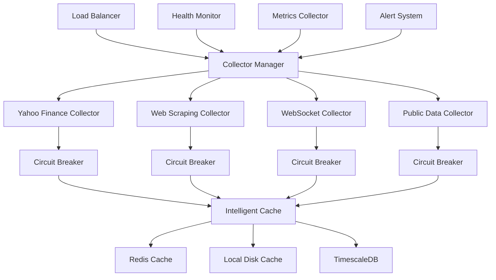

# Especificações Técnicas para Melhoria da Coleta de Dados
## Projeto Nação Trader - Implementação Detalhada

## 1. Arquitetura Proposta

### 1.1 Visão Geral da Nova Arquitetura



### 1.2 Componentes Principais

#### CollectorManager
```python
class CollectorManager:
    """
    Gerenciador central de coletores com balanceamento de carga
    e failover automático.
    """
    
    def __init__(self):
        self.collectors = {
            'yahoo_finance': YahooFinanceCollector(),
            'web_scraping': WebScrapingCollector(),
            'websocket': WebSocketCollector(),
            'public_data': PublicDataCollector()
        }
        self.health_monitor = HealthMonitor()
        self.circuit_breakers = {}
        self.metrics = MetricsCollector()
        
    async def collect_data(self, symbol: str, data_type: str):
        """
        Coleta dados usando a melhor fonte disponível.
        """
        best_collector = await self.select_best_collector(symbol, data_type)
        
        try:
            async with self.circuit_breakers[best_collector.name]:
                data = await best_collector.collect(symbol)
                await self.metrics.record_success(best_collector.name)
                return data
        except CircuitBreakerOpenException:
            # Tentar próxima melhor opção
            fallback_collector = await self.get_fallback_collector(symbol, data_type)
            return await fallback_collector.collect(symbol)
```

## 2. Implementação de Coletores Específicos

### 2.1 Web Scraping Collector

```python
class WebScrapingCollector:
    """
    Coletor baseado em web scraping com rotação de proxies
    e detecção anti-bot.
    """
    
    def __init__(self):
        self.session_pool = SessionPool()
        self.proxy_rotator = ProxyRotator()
        self.rate_limiter = RateLimiter(requests_per_minute=30)
        self.user_agents = UserAgentRotator()
        
    async def scrape_yahoo_finance(self, symbol: str):
        """
        Scraping direto do Yahoo Finance com evasão de detecção.
        """
        await self.rate_limiter.acquire()
        
        session = await self.session_pool.get_session()
        session.headers.update({
            'User-Agent': self.user_agents.get_random(),
            'Accept': 'text/html,application/xhtml+xml,application/xml;q=0.9,*/*;q=0.8',
            'Accept-Language': 'en-US,en;q=0.5',
            'Accept-Encoding': 'gzip, deflate',
            'Connection': 'keep-alive',
        })
        
        proxy = await self.proxy_rotator.get_proxy()
        
        try:
            url = f"https://finance.yahoo.com/quote/{symbol}"
            async with session.get(url, proxy=proxy, timeout=10) as response:
                if response.status == 200:
                    html = await response.text()
                    return await self.parse_yahoo_data(html, symbol)
                else:
                    raise ScrapingException(f"HTTP {response.status}")
        except Exception as e:
            await self.proxy_rotator.mark_proxy_failed(proxy)
            raise e
    
    async def parse_yahoo_data(self, html: str, symbol: str):
        """
        Parser para extrair dados do HTML do Yahoo Finance.
        """
        soup = BeautifulSoup(html, 'html.parser')
        
        try:
            # Extrair preço atual
            price_element = soup.find('fin-streamer', {'data-field': 'regularMarketPrice'})
            current_price = float(price_element.text.replace(',', '')) if price_element else None
            
            # Extrair outros dados
            data = {
                'symbol': symbol,
                'current_price': current_price,
                'timestamp': datetime.now().isoformat(),
                'source': 'yahoo_scraping'
            }
            
            # Extrair dados adicionais usando seletores CSS
            selectors = {
                'open': '[data-test="OPEN-value"]',
                'high': '[data-test="DAYS_RANGE-value"]',
                'volume': '[data-test="TD_VOLUME-value"]',
                'market_cap': '[data-test="MARKET_CAP-value"]'
            }
            
            for field, selector in selectors.items():
                element = soup.select_one(selector)
                if element:
                    data[field] = self.parse_numeric_value(element.text)
            
            return data
            
        except Exception as e:
            logger.error(f"Erro ao fazer parse dos dados do Yahoo para {symbol}: {e}")
            raise ParsingException(f"Falha no parse: {e}")
```

### 2.2 WebSocket Collector

```python
class WebSocketCollector:
    """
    Coletor de dados em tempo real via WebSocket.
    """
    
    def __init__(self):
        self.connections = {}
        self.reconnect_delays = {}
        self.max_reconnect_delay = 300  # 5 minutos
        
    async def start_binance_stream(self, symbols: List[str]):
        """
        Inicia stream WebSocket da Binance para criptomoedas.
        """
        streams = [f"{symbol.lower()}@ticker" for symbol in symbols]
        uri = f"wss://stream.binance.com:9443/ws/{'/'.join(streams)}"
        
        while True:
            try:
                async with websockets.connect(uri) as websocket:
                    self.connections['binance'] = websocket
                    logger.info(f"Conectado ao WebSocket Binance: {len(symbols)} símbolos")
                    
                    async for message in websocket:
                        try:
                            data = json.loads(message)
                            await self.process_binance_ticker(data)
                        except json.JSONDecodeError as e:
                            logger.error(f"Erro ao decodificar mensagem Binance: {e}")
                            
            except websockets.exceptions.ConnectionClosed:
                logger.warning("Conexão WebSocket Binance fechada, reconectando...")
                await self.handle_reconnection('binance')
            except Exception as e:
                logger.error(f"Erro no WebSocket Binance: {e}")
                await self.handle_reconnection('binance')
    
    async def process_binance_ticker(self, data: dict):
        """
        Processa dados de ticker da Binance.
        """
        try:
            processed_data = {
                'symbol': data['s'],
                'current_price': float(data['c']),
                'open_price': float(data['o']),
                'high_price': float(data['h']),
                'low_price': float(data['l']),
                'volume': float(data['v']),
                'price_change_24h': float(data['P']),
                'timestamp': datetime.now().isoformat(),
                'source': 'binance_websocket'
            }
            
            # Enviar para cache e processamento
            await self.cache_data(processed_data)
            await self.notify_subscribers(processed_data)
            
        except (KeyError, ValueError) as e:
            logger.error(f"Erro ao processar ticker Binance: {e}")
    
    async def handle_reconnection(self, connection_name: str):
        """
        Gerencia reconexão com backoff exponencial.
        """
        if connection_name not in self.reconnect_delays:
            self.reconnect_delays[connection_name] = 1
        else:
            self.reconnect_delays[connection_name] = min(
                self.reconnect_delays[connection_name] * 2,
                self.max_reconnect_delay
            )
        
        delay = self.reconnect_delays[connection_name]
        logger.info(f"Aguardando {delay}s antes de reconectar {connection_name}")
        await asyncio.sleep(delay)
```

### 2.3 Public Data Collector

```python
class PublicDataCollector:
    """
    Coletor de dados de fontes públicas e governamentais.
    """
    
    def __init__(self):
        self.fred_api_key = settings.FRED_API_KEY
        self.session = aiohttp.ClientSession()
        
    async def collect_fed_data(self):
        """
        Coleta dados econômicos do Federal Reserve (FRED).
        """
        series_mapping = {
            'DGS10': 'treasury_10y',
            'DFF': 'fed_funds_rate',
            'UNRATE': 'unemployment_rate',
            'CPIAUCSL': 'cpi_inflation',
            'GDP': 'gdp'
        }
        
        base_url = "https://api.stlouisfed.org/fred/series/observations"
        
        for series_id, name in series_mapping.items():
            try:
                params = {
                    'series_id': series_id,
                    'api_key': self.fred_api_key,
                    'file_type': 'json',
                    'limit': 1,
                    'sort_order': 'desc'
                }
                
                async with self.session.get(base_url, params=params) as response:
                    if response.status == 200:
                        data = await response.json()
                        await self.process_fred_data(name, data)
                    else:
                        logger.error(f"Erro ao buscar dados FRED {series_id}: {response.status}")
                        
            except Exception as e:
                logger.error(f"Erro ao coletar dados FRED {series_id}: {e}")
    
    async def collect_bcb_data(self):
        """
        Coleta dados do Banco Central do Brasil.
        """
        series_mapping = {
            '432': 'selic_rate',
            '433': 'cdi_rate', 
            '1': 'usd_brl_rate',
            '433': 'ipca_inflation'
        }
        
        base_url = "https://api.bcb.gov.br/dados/serie/bcdata.sgs"
        
        for series_id, name in series_mapping.items():
            try:
                # Últimos 30 dias
                end_date = datetime.now().strftime('%d/%m/%Y')
                start_date = (datetime.now() - timedelta(days=30)).strftime('%d/%m/%Y')
                
                url = f"{base_url}.{series_id}/dados"
                params = {
                    'formato': 'json',
                    'dataInicial': start_date,
                    'dataFinal': end_date
                }
                
                async with self.session.get(url, params=params) as response:
                    if response.status == 200:
                        data = await response.json()
                        await self.process_bcb_data(name, data)
                    else:
                        logger.error(f"Erro ao buscar dados BCB {series_id}: {response.status}")
                        
            except Exception as e:
                logger.error(f"Erro ao coletar dados BCB {series_id}: {e}")
```

## 3. Sistema de Cache Inteligente

### 3.1 Cache Hierárquico

```python
class IntelligentCache:
    """
    Sistema de cache hierárquico com múltiplas camadas.
    """
    
    def __init__(self):
        self.memory_cache = TTLCache(maxsize=1000, ttl=300)  # 5 minutos
        self.redis_client = redis.Redis.from_url(settings.REDIS_URL)
        self.disk_cache = DiskCache('./cache')
        self.db_client = get_supabase_client()
        
    async def get(self, key: str, symbol: str = None) -> Optional[dict]:
        """
        Busca dados seguindo hierarquia de cache.
        """
        # 1. Cache em memória (mais rápido)
        if key in self.memory_cache:
            await self.record_cache_hit('memory', key)
            return self.memory_cache[key]
        
        # 2. Cache Redis (rápido, persistente)
        redis_data = await self.redis_client.get(key)
        if redis_data:
            data = json.loads(redis_data)
            self.memory_cache[key] = data
            await self.record_cache_hit('redis', key)
            return data
        
        # 3. Cache em disco (médio, local)
        disk_data = await self.disk_cache.get(key)
        if disk_data:
            await self.redis_client.setex(key, 3600, json.dumps(disk_data))
            self.memory_cache[key] = disk_data
            await self.record_cache_hit('disk', key)
            return disk_data
        
        # 4. Banco de dados (lento, completo)
        if symbol:
            db_data = await self.get_from_database(symbol)
            if db_data:
                await self.set_all_caches(key, db_data)
                await self.record_cache_hit('database', key)
                return db_data
        
        await self.record_cache_miss(key)
        return None
    
    async def set(self, key: str, data: dict, ttl: int = 3600):
        """
        Armazena dados em todas as camadas de cache.
        """
        # Memória
        self.memory_cache[key] = data
        
        # Redis
        await self.redis_client.setex(key, ttl, json.dumps(data))
        
        # Disco (para dados importantes)
        if self.is_important_data(data):
            await self.disk_cache.set(key, data)
        
        # Banco de dados (para persistência)
        await self.save_to_database(data)
    
    async def invalidate(self, pattern: str):
        """
        Invalida cache baseado em padrão.
        """
        # Invalidar memória
        keys_to_remove = [k for k in self.memory_cache.keys() if fnmatch.fnmatch(k, pattern)]
        for key in keys_to_remove:
            del self.memory_cache[key]
        
        # Invalidar Redis
        redis_keys = await self.redis_client.keys(pattern)
        if redis_keys:
            await self.redis_client.delete(*redis_keys)
        
        # Invalidar disco
        await self.disk_cache.invalidate(pattern)
```

### 3.2 Cache Preditivo

```python
class PredictiveCache:
    """
    Sistema de cache que antecipa necessidades futuras.
    """
    
    def __init__(self, cache: IntelligentCache):
        self.cache = cache
        self.access_patterns = AccessPatternAnalyzer()
        self.preload_scheduler = PreloadScheduler()
        
    async def analyze_and_preload(self):
        """
        Analisa padrões de acesso e pré-carrega dados.
        """
        # Analisar padrões das últimas 24 horas
        patterns = await self.access_patterns.analyze_recent_patterns(hours=24)
        
        # Identificar ativos mais acessados
        popular_assets = patterns.get_popular_assets(limit=50)
        
        # Identificar horários de pico
        peak_hours = patterns.get_peak_hours()
        
        # Agendar pré-carregamento
        for asset in popular_assets:
            await self.preload_scheduler.schedule_preload(
                asset, 
                before_peak_hours=peak_hours
            )
    
    async def preload_related_assets(self, symbol: str):
        """
        Pré-carrega ativos relacionados quando um ativo é acessado.
        """
        # Encontrar ativos correlacionados
        related_assets = await self.find_correlated_assets(symbol)
        
        # Pré-carregar em background
        for related_symbol in related_assets[:10]:  # Limitar a 10
            asyncio.create_task(self.preload_asset_data(related_symbol))
    
    async def find_correlated_assets(self, symbol: str) -> List[str]:
        """
        Encontra ativos correlacionados usando análise histórica.
        """
        # Implementar análise de correlação
        # Por enquanto, usar regras simples
        correlations = {
            'PETR4.SA': ['VALE3.SA', 'ITUB4.SA', '^BVSP'],
            'AAPL': ['MSFT', 'GOOGL', '^GSPC'],
            'BTC-USD': ['ETH-USD', 'ADA-USD']
        }
        
        return correlations.get(symbol, [])
```

## 4. Circuit Breaker e Resilência

### 4.1 Circuit Breaker Avançado

```python
class AdvancedCircuitBreaker:
    """
    Circuit breaker com múltiplos estados e recuperação gradual.
    """
    
    def __init__(self, 
                 failure_threshold: int = 5,
                 success_threshold: int = 3,
                 timeout: int = 60,
                 half_open_max_calls: int = 3):
        self.failure_threshold = failure_threshold
        self.success_threshold = success_threshold
        self.timeout = timeout
        self.half_open_max_calls = half_open_max_calls
        
        self.failure_count = 0
        self.success_count = 0
        self.last_failure_time = None
        self.state = CircuitState.CLOSED
        self.half_open_calls = 0
        
    async def __aenter__(self):
        if self.state == CircuitState.OPEN:
            if self._should_attempt_reset():
                self.state = CircuitState.HALF_OPEN
                self.half_open_calls = 0
            else:
                raise CircuitBreakerOpenException("Circuit breaker is OPEN")
        
        if self.state == CircuitState.HALF_OPEN:
            if self.half_open_calls >= self.half_open_max_calls:
                raise CircuitBreakerOpenException("Half-open call limit exceeded")
            self.half_open_calls += 1
        
        return self
    
    async def __aexit__(self, exc_type, exc_val, exc_tb):
        if exc_type is None:
            await self._on_success()
        else:
            await self._on_failure()
    
    async def _on_success(self):
        self.failure_count = 0
        
        if self.state == CircuitState.HALF_OPEN:
            self.success_count += 1
            if self.success_count >= self.success_threshold:
                self.state = CircuitState.CLOSED
                self.success_count = 0
        
    async def _on_failure(self):
        self.failure_count += 1
        self.last_failure_time = time.time()
        
        if self.state == CircuitState.HALF_OPEN:
            self.state = CircuitState.OPEN
        elif self.failure_count >= self.failure_threshold:
            self.state = CircuitState.OPEN
    
    def _should_attempt_reset(self) -> bool:
        return (time.time() - self.last_failure_time) >= self.timeout
```

### 4.2 Health Monitor

```python
class HealthMonitor:
    """
    Monitor de saúde para todas as fontes de dados.
    """
    
    def __init__(self):
        self.health_scores = {}
        self.response_times = {}
        self.error_rates = {}
        self.last_checks = {}
        
    async def check_source_health(self, source_name: str, collector) -> HealthStatus:
        """
        Verifica saúde de uma fonte específica.
        """
        start_time = time.time()
        
        try:
            # Fazer uma requisição de teste
            await collector.health_check()
            
            response_time = (time.time() - start_time) * 1000  # ms
            
            # Atualizar métricas
            await self._update_health_metrics(source_name, True, response_time)
            
            # Calcular score de saúde
            health_score = await self._calculate_health_score(source_name)
            
            return HealthStatus(
                source=source_name,
                is_healthy=health_score > 70,
                score=health_score,
                response_time=response_time,
                last_check=datetime.now()
            )
            
        except Exception as e:
            await self._update_health_metrics(source_name, False, None)
            
            return HealthStatus(
                source=source_name,
                is_healthy=False,
                score=0,
                error=str(e),
                last_check=datetime.now()
            )
    
    async def _calculate_health_score(self, source_name: str) -> float:
        """
        Calcula score de saúde baseado em múltiplas métricas.
        """
        # Score baseado em taxa de sucesso (0-40 pontos)
        success_rate = self._get_success_rate(source_name)
        success_score = success_rate * 40
        
        # Score baseado em tempo de resposta (0-30 pontos)
        avg_response_time = self._get_avg_response_time(source_name)
        if avg_response_time < 1000:  # < 1s
            response_score = 30
        elif avg_response_time < 3000:  # < 3s
            response_score = 20
        elif avg_response_time < 5000:  # < 5s
            response_score = 10
        else:
            response_score = 0
        
        # Score baseado em disponibilidade recente (0-30 pontos)
        uptime_score = self._get_recent_uptime(source_name) * 30
        
        return success_score + response_score + uptime_score
```

## 5. Métricas e Observabilidade

### 5.1 Sistema de Métricas

```python
class MetricsCollector:
    """
    Coletor de métricas para observabilidade.
    """
    
    def __init__(self):
        self.metrics_storage = MetricsStorage()
        self.alert_thresholds = AlertThresholds()
        
    async def record_collection_metrics(self, 
                                      source: str, 
                                      symbol: str, 
                                      success: bool, 
                                      response_time: float,
                                      data_quality: float = None):
        """
        Registra métricas de coleta de dados.
        """
        timestamp = datetime.now()
        
        metrics = {
            'timestamp': timestamp,
            'source': source,
            'symbol': symbol,
            'success': success,
            'response_time_ms': response_time,
            'data_quality_score': data_quality
        }
        
        await self.metrics_storage.store(metrics)
        
        # Verificar alertas
        await self._check_alert_conditions(metrics)
    
    async def get_dashboard_metrics(self, time_range: str = '1h') -> dict:
        """
        Retorna métricas para dashboard.
        """
        end_time = datetime.now()
        start_time = end_time - self._parse_time_range(time_range)
        
        metrics = await self.metrics_storage.query(
            start_time=start_time,
            end_time=end_time
        )
        
        return {
            'total_requests': len(metrics),
            'success_rate': self._calculate_success_rate(metrics),
            'avg_response_time': self._calculate_avg_response_time(metrics),
            'requests_per_minute': self._calculate_requests_per_minute(metrics),
            'source_breakdown': self._calculate_source_breakdown(metrics),
            'error_breakdown': self._calculate_error_breakdown(metrics)
        }
```

### 5.2 Sistema de Alertas

```python
class AlertSystem:
    """
    Sistema de alertas baseado em métricas e thresholds.
    """
    
    def __init__(self):
        self.alert_rules = [
            AlertRule(
                name="high_error_rate",
                condition=lambda m: m.get('error_rate', 0) > 0.1,
                severity=AlertSeverity.HIGH,
                cooldown=300  # 5 minutos
            ),
            AlertRule(
                name="slow_response_time",
                condition=lambda m: m.get('avg_response_time', 0) > 5000,
                severity=AlertSeverity.MEDIUM,
                cooldown=600  # 10 minutos
            ),
            AlertRule(
                name="source_unavailable",
                condition=lambda m: m.get('source_availability', 1) < 0.8,
                severity=AlertSeverity.CRITICAL,
                cooldown=60  # 1 minuto
            )
        ]
        self.notification_channels = [
            EmailNotifier(),
            SlackNotifier(),
            WebhookNotifier()
        ]
    
    async def evaluate_alerts(self, metrics: dict):
        """
        Avalia regras de alerta baseado nas métricas.
        """
        for rule in self.alert_rules:
            if rule.should_trigger(metrics):
                alert = Alert(
                    rule_name=rule.name,
                    severity=rule.severity,
                    message=rule.generate_message(metrics),
                    timestamp=datetime.now(),
                    metrics=metrics
                )
                
                await self.send_alert(alert)
    
    async def send_alert(self, alert: Alert):
        """
        Envia alerta através dos canais configurados.
        """
        for channel in self.notification_channels:
            try:
                await channel.send(alert)
            except Exception as e:
                logger.error(f"Erro ao enviar alerta via {channel.name}: {e}")
```

## 6. Configuração e Deploy

### 6.1 Configuração Docker

```dockerfile
# Dockerfile para o novo sistema de coleta
FROM python:3.11-slim

WORKDIR /app

# Instalar dependências do sistema
RUN apt-get update && apt-get install -y \
    curl \
    wget \
    chromium \
    chromium-driver \
    && rm -rf /var/lib/apt/lists/*

# Copiar requirements
COPY requirements.txt .
RUN pip install --no-cache-dir -r requirements.txt

# Copiar código
COPY . .

# Configurar variáveis de ambiente
ENV PYTHONPATH=/app
ENV CHROME_BIN=/usr/bin/chromium
ENV CHROMEDRIVER_PATH=/usr/bin/chromedriver

# Expor porta
EXPOSE 8000

# Comando de inicialização
CMD ["python", "-m", "src.main"]
```

### 6.2 Docker Compose

```yaml
# docker-compose.yml
version: '3.8'

services:
  collector-manager:
    build: .
    environment:
      - REDIS_URL=redis://redis:6379
      - DATABASE_URL=postgresql://user:pass@db:5432/nacao_trader
    depends_on:
      - redis
      - db
    volumes:
      - ./cache:/app/cache
      - ./logs:/app/logs
    restart: unless-stopped
  
  redis:
    image: redis:7-alpine
    volumes:
      - redis_data:/data
    restart: unless-stopped
  
  db:
    image: timescale/timescaledb:latest-pg14
    environment:
      - POSTGRES_DB=nacao_trader
      - POSTGRES_USER=user
      - POSTGRES_PASSWORD=pass
    volumes:
      - db_data:/var/lib/postgresql/data
    restart: unless-stopped
  
  prometheus:
    image: prom/prometheus:latest
    ports:
      - "9090:9090"
    volumes:
      - ./prometheus.yml:/etc/prometheus/prometheus.yml
    restart: unless-stopped
  
  grafana:
    image: grafana/grafana:latest
    ports:
      - "3000:3000"
    environment:
      - GF_SECURITY_ADMIN_PASSWORD=admin
    volumes:
      - grafana_data:/var/lib/grafana
    restart: unless-stopped

volumes:
  redis_data:
  db_data:
  grafana_data:
```

## 7. Testes e Validação

### 7.1 Testes de Integração

```python
class TestCollectorIntegration:
    """
    Testes de integração para o sistema de coleta.
    """
    
    @pytest.mark.asyncio
    async def test_fallback_mechanism(self):
        """
        Testa mecanismo de fallback entre fontes.
        """
        # Simular falha na fonte primária
        with patch('src.collectors.yahoo_finance.YahooFinanceCollector.collect') as mock_yahoo:
            mock_yahoo.side_effect = Exception("API Error")
            
            collector_manager = CollectorManager()
            
            # Deve usar fonte secundária
            data = await collector_manager.collect_data('AAPL', 'realtime')
            
            assert data is not None
            assert data['source'] != 'yahoo_finance'
    
    @pytest.mark.asyncio
    async def test_cache_hierarchy(self):
        """
        Testa hierarquia de cache.
        """
        cache = IntelligentCache()
        
        # Dados não existem em nenhum cache
        data = await cache.get('test_key')
        assert data is None
        
        # Armazenar dados
        test_data = {'symbol': 'AAPL', 'price': 150.0}
        await cache.set('test_key', test_data)
        
        # Deve retornar do cache em memória
        cached_data = await cache.get('test_key')
        assert cached_data == test_data
    
    @pytest.mark.asyncio
    async def test_circuit_breaker(self):
        """
        Testa funcionamento do circuit breaker.
        """
        circuit_breaker = AdvancedCircuitBreaker(failure_threshold=2)
        
        # Simular falhas consecutivas
        for _ in range(3):
            with pytest.raises(Exception):
                async with circuit_breaker:
                    raise Exception("Simulated failure")
        
        # Circuit breaker deve estar aberto
        assert circuit_breaker.state == CircuitState.OPEN
        
        # Próxima tentativa deve falhar imediatamente
        with pytest.raises(CircuitBreakerOpenException):
            async with circuit_breaker:
                pass
```

### 7.2 Testes de Performance

```python
class TestPerformance:
    """
    Testes de performance do sistema.
    """
    
    @pytest.mark.asyncio
    async def test_concurrent_collection(self):
        """
        Testa coleta concorrente de múltiplos ativos.
        """
        symbols = ['AAPL', 'MSFT', 'GOOGL'] * 10  # 30 símbolos
        
        start_time = time.time()
        
        collector_manager = CollectorManager()
        tasks = [collector_manager.collect_data(symbol, 'realtime') for symbol in symbols]
        
        results = await asyncio.gather(*tasks, return_exceptions=True)
        
        end_time = time.time()
        duration = end_time - start_time
        
        # Deve completar em menos de 30 segundos
        assert duration < 30
        
        # Pelo menos 80% dos resultados devem ser bem-sucedidos
        successful_results = [r for r in results if not isinstance(r, Exception)]
        success_rate = len(successful_results) / len(results)
        assert success_rate >= 0.8
    
    @pytest.mark.asyncio
    async def test_cache_performance(self):
        """
        Testa performance do sistema de cache.
        """
        cache = IntelligentCache()
        
        # Pré-popular cache
        for i in range(1000):
            await cache.set(f'key_{i}', {'data': f'value_{i}'})
        
        # Testar velocidade de acesso
        start_time = time.time()
        
        for i in range(1000):
            data = await cache.get(f'key_{i}')
            assert data is not None
        
        end_time = time.time()
        duration = end_time - start_time
        
        # Deve acessar 1000 itens em menos de 1 segundo
        assert duration < 1.0
```

## 8. Monitoramento e Observabilidade

### 8.1 Configuração Prometheus

```yaml
# prometheus.yml
global:
  scrape_interval: 15s

scrape_configs:
  - job_name: 'nacao-trader-collector'
    static_configs:
      - targets: ['collector-manager:8000']
    metrics_path: '/metrics'
    scrape_interval: 30s

rule_files:
  - "alert_rules.yml"

alerting:
  alertmanagers:
    - static_configs:
        - targets:
          - alertmanager:9093
```

### 8.2 Dashboards Grafana

```json
{
  "dashboard": {
    "title": "Nação Trader - Data Collection",
    "panels": [
      {
        "title": "Requests per Second",
        "type": "graph",
        "targets": [
          {
            "expr": "rate(data_collection_requests_total[5m])",
            "legendFormat": "{{source}}"
          }
        ]
      },
      {
        "title": "Success Rate",
        "type": "stat",
        "targets": [
          {
            "expr": "rate(data_collection_requests_successful[5m]) / rate(data_collection_requests_total[5m]) * 100"
          }
        ]
      },
      {
        "title": "Response Time",
        "type": "graph",
        "targets": [
          {
            "expr": "histogram_quantile(0.95, rate(data_collection_duration_seconds_bucket[5m]))",
            "legendFormat": "95th percentile"
          }
        ]
      },
      {
        "title": "Cache Hit Rate",
        "type": "stat",
        "targets": [
          {
            "expr": "rate(cache_hits_total[5m]) / (rate(cache_hits_total[5m]) + rate(cache_misses_total[5m])) * 100"
          }
        ]
      }
    ]
  }
}
```

## 9. Conclusão

Esta especificação técnica fornece um roadmap detalhado para implementar um sistema robusto e independente de coleta de dados financeiros. As principais melhorias incluem:

1. **Diversificação de Fontes**: Múltiplas fontes com fallback automático
2. **Cache Inteligente**: Sistema hierárquico com predição
3. **Resilência**: Circuit breakers e recuperação automática
4. **Observabilidade**: Métricas detalhadas e alertas
5. **Escalabilidade**: Arquitetura distribuída e assíncrona

A implementação deve ser feita de forma incremental, testando cada componente antes de integrar ao sistema principal. O resultado será um sistema de coleta de dados mais confiável, performático e independente de APIs externas.
