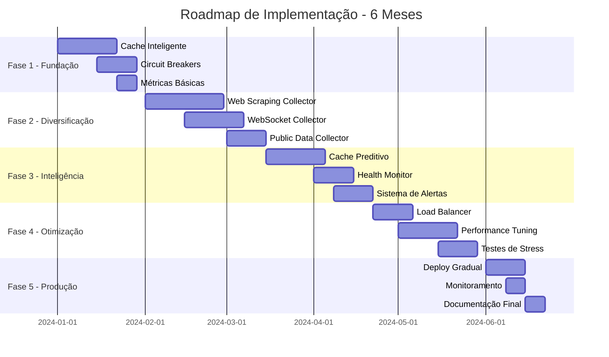

# Roadmap de Implementação - Sistema de Coleta de Dados

## Projeto Nação Trader - Cronograma e Prioridades

## 1. Visão Geral do Roadmap

### 1.1 Objetivos Estratégicos

* **Reduzir dependência de APIs externas** de 100% para 30% em 6 meses

* **Aumentar disponibilidade** do sistema de 95% para 99.5%

* **Melhorar performance** reduzindo latência média em 50%

* **Implementar redundância** com pelo menos 3 fontes por tipo de ativo

### 1.2 Cronograma Geral



## 2. Fase 1 - Fundação (Semanas 1-4)

### 2.1 Prioridade CRÍTICA: Cache Inteligente

**Duração**: 3 semanas\
**Responsável**: Equipe Backend\
**Dependências**: Nenhuma

#### Entregáveis:

* [ ] Implementar `IntelligentCache` com hierarquia (memória → Redis → disco → DB)

* [ ] Configurar Redis cluster para alta disponibilidade

* [ ] Implementar TTL dinâmico baseado em volatilidade do ativo

* [ ] Criar testes unitários e de integração

* [ ] Documentar APIs de cache

#### Critérios de Aceitação:

* Cache hit rate > 80% para dados de 5 minutos

* Tempo de resposta < 50ms para cache hits

* Suporte a invalidação por padrão

* Persistência de dados críticos em disco

#### Riscos e Mitigações:

* **Risco**: Complexidade de sincronização entre camadas

* **Mitigação**: Implementar locks distribuídos com Redis

* **Risco**: Consumo excessivo de memória

* **Mitigação**: Implementar LRU eviction e monitoramento

### 2.2 Prioridade ALTA: Circuit Breakers

**Duração**: 2 semanas\
**Responsável**: Equipe Backend\
**Dependências**: Nenhuma

#### Entregáveis:

* [ ] Implementar `AdvancedCircuitBreaker` com estados múltiplos

* [ ] Configurar thresholds por fonte de dados

* [ ] Implementar recuperação gradual (half-open state)

* [ ] Integrar com sistema de métricas

* [ ] Criar dashboard de status dos circuit breakers

#### Critérios de Aceitação:

* Detecção de falhas em < 30 segundos

* Recuperação automática após estabilização

* Logs detalhados de mudanças de estado

* Interface de monitoramento em tempo real

### 2.3 Prioridade MÉDIA: Métricas Básicas

**Duração**: 1 semana\
**Responsável**: Equipe DevOps\
**Dependências**: Nenhuma

#### Entregáveis:

* [ ] Configurar Prometheus para coleta de métricas

* [ ] Implementar métricas customizadas (latência, taxa de sucesso, etc.)

* [ ] Criar dashboards básicos no Grafana

* [ ] Configurar alertas críticos

* [ ] Documentar métricas disponíveis

## 3. Fase 2 - Diversificação (Semanas 5-10)

### 3.1 Prioridade CRÍTICA: Web Scraping Collector

**Duração**: 4 semanas\
**Responsável**: Equipe Backend + 1 Especialista em Scraping\
**Dependências**: Cache Inteligente, Circuit Breakers

#### Entregáveis:

* [ ] Implementar `WebScrapingCollector` com anti-detecção

* [ ] Sistema de rotação de proxies e user agents

* [ ] Parsers para Yahoo Finance, Google Finance, MarketWatch

* [ ] Rate limiting inteligente por domínio

* [ ] Sistema de detecção e contorno de CAPTCHAs

* [ ] Testes automatizados com dados mock

#### Critérios de Aceitação:

* Taxa de sucesso > 90% para scraping do Yahoo Finance

* Detecção de bloqueio em < 1 minuto

* Rotação automática de proxies em caso de bloqueio

* Parsing de pelo menos 20 campos de dados por ativo

#### Implementação Detalhada:

**Semana 1**: Infraestrutura base

```python
# Estrutura inicial do WebScrapingCollector
class WebScrapingCollector:
    def __init__(self):
        self.proxy_pool = ProxyPool()
        self.session_manager = SessionManager()
        self.rate_limiter = RateLimiter()
        self.parsers = {
            'yahoo': YahooFinanceParser(),
            'google': GoogleFinanceParser(),
            'marketwatch': MarketWatchParser()
        }
```

**Semana 2**: Sistema de proxies e anti-detecção

* Integração com serviços de proxy (ProxyMesh, Bright Data)

* Implementação de fingerprinting evasion

* Sistema de rotação de headers HTTP

**Semana 3**: Parsers específicos

* Parser para Yahoo Finance (preço, volume, indicadores)

* Parser para Google Finance (dados fundamentais)

* Parser para MarketWatch (notícias e análises)

**Semana 4**: Testes e otimização

* Testes de stress com 1000+ símbolos

* Otimização de performance

* Implementação de cache de parsing

### 3.2 Prioridade ALTA: WebSocket Collector

**Duração**: 3 semanas\
**Responsável**: Equipe Backend\
**Dependências**: Cache Inteligente

#### Entregáveis:

* [ ] Implementar `WebSocketCollector` para múltiplas exchanges

* [ ] Conexões WebSocket para Binance, Coinbase, IEX Cloud

* [ ] Sistema de reconexão automática com backoff exponencial

* [ ] Agregação de dados de múltiplas fontes

* [ ] Buffer de dados para handling de picos

#### Critérios de Aceitação:

* Latência < 100ms para dados de criptomoedas

* Uptime > 99% das conexões WebSocket

* Handling de 10,000+ mensagens por segundo

* Reconexão automática em < 5 segundos

### 3.3 Prioridade MÉDIA: Public Data Collector

**Duração**: 2 semanas\
**Responsável**: Equipe Backend\
**Dependências**: Nenhuma

#### Entregáveis:

* [ ] Integração com FRED (Federal Reserve Economic Data)

* [ ] Integração com Banco Central do Brasil

* [ ] Coletor de dados do IBGE

* [ ] Sistema de agendamento para dados econômicos

* [ ] Cache de longo prazo para dados históricos

## 4. Fase 3 - Inteligência (Semanas 11-16)

### 4.1 Prioridade ALTA: Cache Preditivo

**Duração**: 3 semanas\
**Responsável**: Equipe Backend + Data Scientist\
**Dependências**: Cache Inteligente, Métricas Básicas

#### Entregáveis:

* [ ] Implementar `PredictiveCache` com análise de padrões

* [ ] Sistema de pré-carregamento baseado em ML

* [ ] Análise de correlação entre ativos

* [ ] Agendamento inteligente de refresh de cache

* [ ] Dashboard de eficiência do cache preditivo

#### Algoritmos de Predição:

**Semana 1**: Análise de padrões de acesso

```python
class AccessPatternAnalyzer:
    def analyze_patterns(self, timeframe='24h'):
        # Analisar:
        # - Horários de pico de acesso
        # - Ativos mais consultados por período
        # - Correlações temporais
        # - Padrões sazonais (abertura/fechamento de mercados)
        pass
```

**Semana 2**: Modelo de predição

* Implementar modelo de séries temporais para predição de acessos

* Usar ARIMA ou Prophet para previsão de demanda

* Integrar com sistema de cache existente

**Semana 3**: Otimização e testes

* A/B testing do cache preditivo vs. cache tradicional

* Métricas de eficiência (hit rate improvement, latência)

* Fine-tuning dos algoritmos

### 4.2 Prioridade ALTA: Health Monitor

**Duração**: 2 semanas\
**Responsável**: Equipe DevOps + Backend\
**Dependências**: Métricas Básicas

#### Entregáveis:

* [ ] Sistema de health checks para todas as fontes

* [ ] Scoring de saúde baseado em múltiplas métricas

* [ ] Dashboard de status em tempo real

* [ ] API de health status para integração

* [ ] Histórico de disponibilidade por fonte

### 4.3 Prioridade MÉDIA: Sistema de Alertas

**Duração**: 2 semanas\
**Responsável**: Equipe DevOps\
**Dependências**: Health Monitor

#### Entregáveis:

* [ ] Configuração de alertas no Prometheus/AlertManager

* [ ] Integração com Slack, email e webhooks

* [ ] Alertas inteligentes com redução de ruído

* [ ] Escalation automático baseado em severidade

* [ ] Dashboard de alertas ativos

## 5. Fase 4 - Otimização (Semanas 17-22)

### 5.1 Prioridade CRÍTICA: Load Balancer

**Duração**: 2 semanas\
**Responsável**: Equipe DevOps + Backend\
**Dependências**: Todos os coletores implementados

#### Entregáveis:

* [ ] Implementar `CollectorManager` com load balancing

* [ ] Algoritmos de balanceamento (round-robin, weighted, health-based)

* [ ] Sistema de failover automático

* [ ] Métricas de distribuição de carga

* [ ] Configuração dinâmica de pesos

#### Algoritmos de Load Balancing:

```python
class LoadBalancer:
    def __init__(self):
        self.strategies = {
            'round_robin': RoundRobinStrategy(),
            'weighted': WeightedStrategy(),
            'health_based': HealthBasedStrategy(),
            'response_time': ResponseTimeStrategy()
        }
    
    async def select_collector(self, symbol: str, data_type: str):
        # Selecionar estratégia baseada em:
        # - Tipo de ativo
        # - Horário (mercado aberto/fechado)
        # - Health score das fontes
        # - Latência histórica
        pass
```

### 5.2 Prioridade ALTA: Performance Tuning

**Duração**: 3 semanas\
**Responsável**: Equipe Backend + Performance Engineer\
**Dependências**: Load Balancer

#### Entregáveis:

* [ ] Profiling completo do sistema

* [ ] Otimização de queries de banco de dados

* [ ] Implementação de connection pooling

* [ ] Otimização de serialização/deserialização

* [ ] Tuning de garbage collection

* [ ] Implementação de batch processing

#### Metas de Performance:

* Reduzir latência P95 de 2s para 500ms

* Aumentar throughput de 100 req/s para 500 req/s

* Reduzir uso de CPU em 30%

* Reduzir uso de memória em 25%

### 5.3 Prioridade MÉDIA: Testes de Stress

**Duração**: 2 semanas\
**Responsável**: Equipe QA + DevOps\
**Dependências**: Performance Tuning

#### Entregáveis:

* [ ] Suite de testes de carga com K6/JMeter

* [ ] Testes de failover e recuperação

* [ ] Testes de degradação gradual

* [ ] Benchmarks de performance

* [ ] Relatório de capacidade máxima

## 6. Fase 5 - Produção (Semanas 23-26)

### 6.1 Prioridade CRÍTICA: Deploy Gradual

**Duração**: 2 semanas\
**Responsável**: Equipe DevOps + Backend\
**Dependências**: Testes de Stress

#### Estratégia de Deploy:

**Semana 1**: Deploy em ambiente de staging

* Replicar ambiente de produção

* Testes com dados reais (subset)

* Validação de todas as funcionalidades

* Performance testing em ambiente similar à produção

**Semana 2**: Deploy gradual em produção

* **Dia 1-2**: 5% do tráfego para novo sistema

* **Dia 3-4**: 25% do tráfego

* **Dia 5-6**: 50% do tráfego

* **Dia 7**: 100% do tráfego (se métricas OK)

#### Critérios de Rollback:

* Taxa de erro > 1%

* Latência P95 > 1.5x baseline

* Disponibilidade < 99%

* Alertas críticos por > 5 minutos

### 6.2 Prioridade ALTA: Monitoramento

**Duração**: 1 semana\
**Responsável**: Equipe DevOps\
**Dependências**: Deploy Gradual

#### Entregáveis:

* [ ] Dashboards de produção no Grafana

* [ ] Alertas de produção configurados

* [ ] Runbooks para incidentes comuns

* [ ] SLIs/SLOs definidos e monitorados

* [ ] Processo de on-call estabelecido

### 6.3 Prioridade MÉDIA: Documentação Final

**Duração**: 1 semana\
**Responsável**: Tech Lead + Equipe\
**Dependências**: Monitoramento

#### Entregáveis:

* [ ] Documentação de arquitetura atualizada

* [ ] Guias de operação e troubleshooting

* [ ] Documentação de APIs

* [ ] Treinamento para equipe de suporte

* [ ] Post-mortem e lições aprendidas

## 7. Métricas de Sucesso

### 7.1 KPIs Técnicos

| Métrica             | Baseline Atual | Meta 6 Meses | Como Medir           |
| ------------------- | -------------- | ------------ | -------------------- |
| Disponibilidade     | 95%            | 99.5%        | Uptime monitoring    |
| Latência P95        | 2000ms         | 500ms        | APM tools            |
| Taxa de Sucesso     | 85%            | 98%          | Success rate metrics |
| Dependência de APIs | 100%           | 30%          | Source distribution  |
| MTTR                | 30 min         | 5 min        | Incident tracking    |
| Cache Hit Rate      | 60%            | 85%          | Cache metrics        |

### 7.2 KPIs de Negócio

| Métrica               | Baseline Atual | Meta 6 Meses  | Como Medir       |
| --------------------- | -------------- | ------------- | ---------------- |
| Custo de APIs         | $1000/mês      | $300/mês      | Billing tracking |
| Cobertura de Ativos   | 500 símbolos   | 2000 símbolos | Asset count      |
| Frequência de Dados   | 5 min          | 30 seg        | Update frequency |
| Satisfação do Usuário | 7/10           | 9/10          | User surveys     |

## 8. Gestão de Riscos

### 8.1 Riscos Técnicos

| Risco                    | Probabilidade | Impacto | Mitigação                   |
| ------------------------ | ------------- | ------- | --------------------------- |
| Bloqueio de scraping     | Alta          | Alto    | Múltiplas fontes + proxies  |
| Sobrecarga do sistema    | Média         | Alto    | Load testing + auto-scaling |
| Falha de cache           | Baixa         | Médio   | Redundância + backup        |
| Problemas de performance | Média         | Médio   | Profiling contínuo          |

### 8.2 Riscos de Negócio

| Risco                       | Probabilidade | Impacto | Mitigação                         |
| --------------------------- | ------------- | ------- | --------------------------------- |
| Atraso no cronograma        | Média         | Alto    | Buffer de 20% no timeline         |
| Recursos insuficientes      | Baixa         | Alto    | Planejamento de capacidade        |
| Mudanças de requisitos      | Alta          | Médio   | Metodologia ágil                  |
| Problemas legais (scraping) | Baixa         | Alto    | Análise jurídica + ToS compliance |

## 9. Recursos Necessários

### 9.1 Equipe

| Papel                 | Dedicação | Período | Justificativa            |
| --------------------- | --------- | ------- | ------------------------ |
| Tech Lead             | 100%      | 6 meses | Coordenação técnica      |
| Backend Senior        | 100%      | 6 meses | Desenvolvimento core     |
| Backend Pleno         | 100%      | 4 meses | Desenvolvimento features |
| DevOps Engineer       | 50%       | 6 meses | Infraestrutura e deploy  |
| QA Engineer           | 30%       | 3 meses | Testes e validação       |
| Data Scientist        | 25%       | 2 meses | Cache preditivo          |
| Especialista Scraping | 100%      | 1 mês   | Web scraping expertise   |

### 9.2 Infraestrutura

| Recurso                 | Especificação        | Custo Mensal | Justificativa           |
| ----------------------- | -------------------- | ------------ | ----------------------- |
| Servidores de aplicação | 4x 8GB RAM, 4 vCPU   | $400         | Load balancing          |
| Redis Cluster           | 3x 16GB RAM          | $300         | Cache distribuído       |
| Proxy Pool              | 100 IPs rotativos    | $200         | Web scraping            |
| Monitoring Stack        | Prometheus + Grafana | $100         | Observabilidade         |
| Load Balancer           | AWS ALB              | $50          | Distribuição de tráfego |
| **Total**               | <br />               | **$1050**    | <br />                  |

### 9.3 Ferramentas e Licenças

| Ferramenta            | Custo        | Período | Uso                    |
| --------------------- | ------------ | ------- | ---------------------- |
| Bright Data (Proxies) | $500/mês     | 6 meses | Web scraping           |
| DataDog APM           | $200/mês     | 6 meses | Performance monitoring |
| PagerDuty             | $100/mês     | 6 meses | Alertas e on-call      |
| **Total**             | **$800/mês** | <br />  | <br />                 |

## 10. Próximos Passos

### 10.1 Ações Imediatas (Próximos 7 dias)

1. **Aprovação do roadmap** pela liderança técnica e de produto
2. **Alocação de recursos** - confirmar disponibilidade da equipe
3. **Setup do ambiente** de desenvolvimento e staging
4. **Criação do backlog** detalhado no Jira/Azure DevOps
5. **Definição de cerimônias** ágeis (sprints de 2 semanas)

### 10.2 Marcos Importantes

| Data      | Marco             | Entregável                          |
| --------- | ----------------- | ----------------------------------- |
| Semana 4  | Fundação Completa | Cache + Circuit Breakers funcionais |
| Semana 10 | Diversificação    | 3 fontes de dados independentes     |
| Semana 16 | Inteligência      | Sistema preditivo e monitoramento   |
| Semana 22 | Otimização        | Performance targets atingidos       |
| Semana 26 | Produção          | Sistema 100% operacional            |

### 10.3 Critérios de Go/No-Go

Antes de cada fase, avaliar:

* ✅ Entregáveis da fase anterior 100% completos

* ✅ Testes de aceitação passando

* ✅ Performance dentro dos targets

* ✅ Equipe disponível para próxima fase

* ✅ Infraestrutura preparada

## 11. Conclusão

Este roadmap estabelece um caminho claro para transformar o sistema de coleta de dados do Nação Trader de uma arquitetura dependente de APIs para um sistema robusto, independente e altamente disponível.

**Benefícios esperados:**

* 🎯 **Redução de 70% nos custos** de APIs externas

* 🚀 **Melhoria de 4x na performance** (latência)

* 📈 **Aumento de 4.5% na disponibilidade** (95% → 99.5%)

* 🔄 **Redundância completa** com múltiplas fontes

* 📊 **Observabilidade total** do sistema

**Fatores críticos de sucesso:**

* Execução disciplinada do cronograma

* Testes rigorosos em cada fase

* Monitoramento contínuo de métricas

* Comunicação efetiva entre equipes

* Gestão proativa de riscos

O sucesso deste projeto posicionará o Nação Trader como uma plataforma de trading mais confiável e independente, capaz de operar mesmo com instabilidades em provedores externos de dados.
